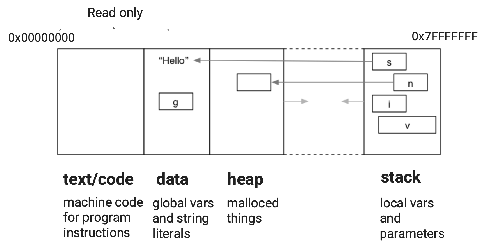

# Revision


## Memory


2. The following snippet of C code declares two variables, `s1` and `s2`, with some subtle differences between them.

   ```c
   #include <stdio.h>
   
   char *s1 = "abc"; // global variable
   
   int main(int argv, char *argc) {
       char *s2 = "def"; // local variable
       // ...
   }
   ```

   - What is a *global variable*?

   Variable that can be accessed from any function within the file, or other files using extern. Stored in data

   - How do they differ from local variables? Where are they each located in memory?

   Located inside a function and also can only be accessed from within that function. Stored in stack

   - What is a string literal? Where are they located in memory?

   Stored in data, unchangeable string/sequence of characters.

   - What does the memory layout of a typical program look like?

   

   

3. What is wrong with the following code?                   **demo in `fix_ptr.c`**

   ```c
   #include <stdio.h>
   
   int *get_num_ptr(void);
   
   int main(void) {
       int *num = get_num_ptr();
       printf("%d\n", *num);
   }
   
   int *get_num_ptr(void) {
       int x = 42;
       return &x;
   }
   ```

   Assuming we still want `get_num_ptr` to return a pointer, how can we fix this code?

   How does fixing this code affect each variable's location in memory?


## Recursion

7. Consider the following C program:  

   ```c
   #include <stdio.h>
   
   int sum(int n);
   
   // This program scans in a number n and prints the sum of all integers up to and including n. 
   // Rewrite the sum function so it uses recursion instead of a loop.
   // What happens in memory when this program runs? What is the difference between the loop and recursive versions?
   
   int main(int argc, char *argv[]) {
           int n;
           printf("Enter a number: ");
           scanf("%d", &n);
   
           int result = sum(n);
           printf("Sum of all numbers up to %d = %d\n", n, result);
   
           return 0;
   }
   
   // Iterative solution
   int sum(int n) {
       int result = 0;
       for (int i = 0; i <= n; i++) {
           result += i;
       }
       return result;
   }
   
   // Recursive solution
   int sum(int n) {
     	// Base case (exit condition)
     	if (n == 0) {
         return 0;
       }
     	
     	// Else
     	return n + sum(n - 1);
   }
   ```

   This program scans in a number ```n``` and prints the sum of all integers up to and including ```n```. 

   Rewrite the sum function so it uses recursion instead of a loop.

   What happens in memory when this program runs? What is the difference between the loop and recursive versions?

   - In the interative version, there is only one call to sum function and all the variables are stored on the stack
   - In the recursive version, more memory is allocated for each call to the sum function to store its different arguments.


## Command Line Arguments


8. 

```c
#include <stdio.h>

int main(int argc, char *argv[]) {
    printf("argc=%d\n", argc);
    for (int i = 0; i < argc; i++) {
        printf("argv[%d]=%s\n", i, argv[i]);
    }
    return 0;
}
```

What are argc and argv in the program above?

- argc is the count, argv is an array of the arguments

What will be the output of the following commands?

```
$ dcc -o print_arguments print_arguments.c
$ ./print_arguments I love MIPS
```

argc = 4

argv[0] = "./print_arguments"

argv[1] = "I"

argv[2] = "love"

argv[3] = "MIPS"


9. The following program sums up command-line arguments.

Why do we need the function atoi in the following program?

```c
#include <stdio.h>
#include <stdlib.h>

int main(int argc, char *argv[]) {
    int sum = 0;
    for (int i = 0; i < argc; i++) {
        sum += atoi(argv[i]);
    }
    printf("sum of command-line arguments = %d\n", sum);
    return 0;
}
```

- command line arguments are not in integer format, so cannot be summed


## Extra


5. Write a c program `count_chars.c` that uses [getchar](https://man7.org/linux/man-pages/man3/getchar.3p.html) to read in characters until the user enters Ctrl-D and then prints the total number of characters entered.

​	Use `man 3 getchar` to look at the manual entry.


6. Consider the following while loop:

   ```c
   #include <stdio.h>
   
   int main(void) {
     // int i = 0;
     // while (i < 10) {
     //   printf("%d\n", i);
     //   i++;
     // }
     
     for (int i = 0; i < 10; i++) {
       printf("%d\n", i);
     }
     return 0;
   }
   ```

   How could we rewrite the above program using a for loop? What subtle difference would there be between the two programs?