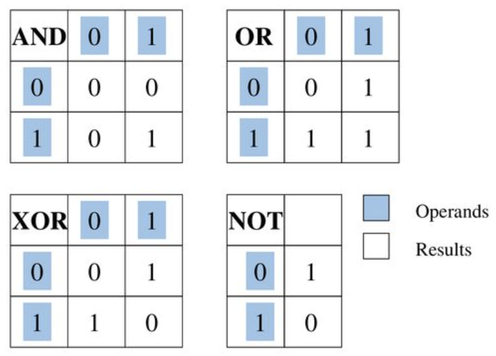

# Binary, Octal, Decimal and Hexadecimal


## Binary (base 2)

- `0b`  prefix
- e.g. `0b00111100`
- all information processed by a computer is in 0's and 1's!
- **bitwise operations** are performed on the binary representation of numbers

## Octal (base 8)

- `0`  prefix (sometimes has `0o`  prefix)
- e.g. `0777` 
- **file permissions** are typically in this format

## Decimal (base 10)

- e.g. `909`
- everyday use of numbers are typically in decimal format

## Hexadecimal (base 16)

- `0x`  prefix
- e.g. `0xABC8`
- used for **memory addresses** as they can store large numbers in a compact way


Q2. Show what the following decimal values look like in 8-bit binary, 3-digit octal, and 2-digit hexadecimal

**15**   -> 0b 0000 1111 -> 0017 -> 0x0F

**127** -> 0b0111 1111 -> 0 -> 0x7F


```shell
# Easy way to convert between bases in your terminal! (can be used in final exam)
$ python3
>>> bin(246)			# Convert decimal 29 into binary
'0b11101'
>>> oct(29)				# Convert into octal
'0o35'
>>> hex(29)				# Convert into hex
'0x1d'
>>> int(0x1d) 		# Convert back into decimal
29
>>> ctrl-D 				# to exit
```


# Bitwise Operations


### What is a mask

Bit masking is the process of getting the processor to ignore all the bits that we don't want to work on and only process the bits we want to process


Create a mask for each:

```c
// Extract the lower 4 bits of a number
mask = 0b00001111
  
// Extract the bits from position 4-9
mask = 0b1111110000
```


### & and

Think of this as an **extracting** operation - whichever bits are set in the mask, is extracted out of the original value

```c
//   0b xxxx xxxx  -- original value
// & 0b 0011 1100  -- mask
// = 0b 00xx xx00  -- final result

//   0b 1110 0101  -- original value
// & 0b 0100 1001  -- mask
// = 0b 0100 0001  -- final result

int a = 20 & 5;
//   0b 0001 0100
// & 0b 0000 0101
// = 0b 0000 0100
```


### | or

Think of this as a **setting** operation - whichever bits are set in the mask, are set in the final value

```c
//   0b xxxx xxxx  -- original value
// | 0b 0110 0110  -- mask
// = 0b x11x x11x  -- final value

//   0b 1000 1000  -- original value
// | 0b 0000 1111  -- mask
// = 0b 1000 1111
```


### ^ XOR

XOR means if **ONLY ONE OR THE OTHER** bit is set, the final result is set. Exclusive OR. Not both, not neither.

```c
//   0b 1010 0000  -- original value
// | 0b 0010 1111  -- mask
// = 0b 1000 1111. -- final value
```


### ~ not

Flips every bit

```
  ~ 0b 1111 0000
  = 0b 0000 1111
```


### << left shift

Shifts all the bits to the left, pads the right bits with 0

```c
uint8_t a = 0b 1000 1111 << 5 
  a = 0b 1110 0000
```


### >> right shift

Shifts all the bits to the right

- unsigned variables do a logical shift
- signed variables do a arithmetic shift

```c
uint8_t b = 0b 0000 0111 >> 3	// b = 0
int8_t a = 0b 1000 0000 >> 3  // a = 0b 1111 0000
  int8_t c = 0b 1000 0000 >> 1  // a = 0b 1100 0000

```


### BCD - binary coded decimals (will be in labs!)

BCD is where each byte (8 bits, or 2 hex digits) is interpreted as 1 digit in decimal.

Note - all BCD's must be between 0 and 9 inclusive as that is the limit of a decimal. 0x0A0F would not be a valid

```shell
$ ./bcd 0x0A    # !! Not a valid BCD as A cannot be represented as a decimal digit from 0-9
$ ./bcd 0x07    # equivalent to decimal
$ ./bcd 0x 01 02  # equivalent to decimal  2x16**0 + 1 x 16**2 - wrong, 
# split it up into groups of two hex digits
# 0x0102 = 12
$ ./bcd 0x 04 02  # equivalent to decimal
#.      42
0x08 09 02 03 04
89234
```


Packed BCD's are where the digits are packed closer together. So now each half byte (4 bits) is interpreted as 1 digit in decimal

```shell
$ ./packed_bcd 0x 1 7   # equivalent to decimal 17
$ ./packed_bcd 0x 4 1 0 2 # equivalent to decimal 4102
```

