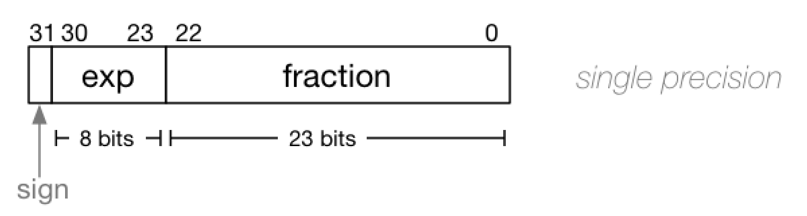

# Floating Point Numbers (IEEE754)


### What is the IEEE 754 standard?

- Sometimes we need to encode very small or very large numbers in a compact form
- Scientific notation helps us do that

- IEEE 754 is a way to encode **binary** scientific notation in 32 bits (scientific notation can be applied to any base!)
  - The binary number 10001.011 would be represented as base-2 scientific notation as 1.0001011 x 2^4
    - Note that in binary, the single bit to the left of the decimal point **MUST BE** 1 


### Components



- **Sign bit**: 0 for positive, 1 for negative
- **Exponent bits** store a value in the range [0, 255]
- The actual value of the exponent is ```exponent - bias``` so that we can store negatives. The bias is 127 so we can actually store the range [-127, 128]
- **Fraction** bits represent a binary fraction


### IEEE 754 Standard: Special Cases


### Tutorial Q4

What decimal numbers do the following single-precision IEEE 754-encoded bit-strings represent?

1. `0 00000000 00000000000000000000000` 
2. `1 00000000 00000000000000000000000` 
3. `0 01111111 10000000000000000000000`  
4. `0 01111110 00000000000000000000000`
5. `0 01111110 11111111111111111111111`
6. `0 10000000 01100000000000000000000`
7. `0 10010100 10000000000000000000000`
8. `0 01101110 10100000101000001010000`

Each of the above is a single 32-bit bit-string, but partitioned to show the sign, exponent and fraction parts.


### Tutorial Q5

Convert the following decimal numbers into IEEE 754-encoded bit-strings:

1. 2.5

2. 0.375
3. 27.0
4. 100.0


