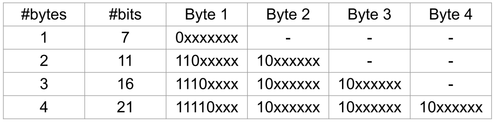

# UTF-8

7. Recall the UTF-8 encoding for characters below:

   Why did UTF-8 replace the ASCII coding standard? What is the difference in how ASCII and UTF-8 codepoints are represented in bytes?

   ```
   We are able to represent a larger number of characters, such as different languages and emojis with UTF-8
   
   ASCII characters only take up one byte, however, UTF-8 characters are variable width (1-4 bytes long) to efficiently store a wider range of characters
   ```

8. Write a C program that reads a null-terminated UTF-8 string as a command line argument and counts how many Unicode characters (code points) it contains. Assume that all codepoints in the string are valid. Some examples of how your program should work:

   ```
   $ gcc count_utf8.c -o count_utf8
   $ ./count_utf8 "チョコミント、よりもあなた！"
   there are 14 codepoints in the string
   $ ./count_utf8 "早上好中国现在我有冰淇淋"
   there are 12 codepoints in the string
   $ ./count_utf8 "🤓🤓🤓🤓🤓🤓🤓🤓"
   there are 8 codepoints in the string
   ```

   **_demo in `count_utf8.c`_**


# Environment variables

4. Write a C program, `print_diary.c`, which prints the contents of the file `$HOME/.diary` to stdout.

   `snprintf` is a convenient function for constructing the pathname of the diary file.

   ```
   <whatever HOME env variable is set to>/.diary
   $HOME/.diary == /home/codespace/.diary
   ```


# fseek

2. Consider the `fseek(FILE *stream, long offset, int whence)` function.

   1. What is its purpose?

      move the file position to your own value

   2. When would it be useful?

      when you have predefined offsets or you know exactly where in the file values are stored.

   3. What does it's return value represent?

      0 on success, -1 on error

3. Consider a file of size 10000 bytes, open for reading on file descriptor `fd`, initially positioned at the start of the file (offset 0). What will be the file position after each of these calls to `lseek()`? Assume that they are executed in sequence, and one will change the file state that the next one deals with.

   1. `fseek(fp, 0, SEEK_END);`          position = 10000
   2. `fseek(fp, -1000, SEEK_CUR);`  position = 9000
   3. `fseek(fp, 0, SEEK_SET);`          position = 0
   4. `fseek(fp, -100, SEEK_SET);`   position = 0
   5. `fseek(fp, 1000, SEEK_SET);`   position = 1000
   6. `fseek(fp, 1000, SEEK_CUR);`   position = 2000